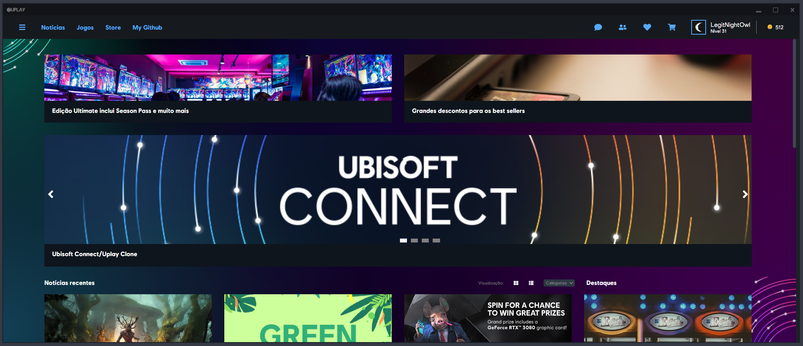

# Uplay Clone
This is a Clone of Ubisoft's [Uplay](https://ubisoftconnect.com/) mostly in UI but also has some functionality, it gets its game list and data from the [GameDetails](https://github.com/Rawallon/uplay-clone/blob/master/src/global/GamesDetails.js) file. 
However, this isn't 100% finished project nor a pixel-perfect replica, but since Ubisoft decided to transform "Uplay" into "Ubisoft Connect" and has been making slight changes for the past few days it'll most likely become a game of cat and mouse. Given this I've decided to release and leave as it is *for now*.

## Screenshot


## Tech Used
 - React
 - Styled Components
 - React-Router-DOM
 - React-Icons
 - React Spring

## Running it

 ```bash
# Clone this repo
$ git clone https://github.com/Rawallon/uplay-clone

# To install dependencies!
$ npm i

# To make it go!
$ npm start

# Horay!
```